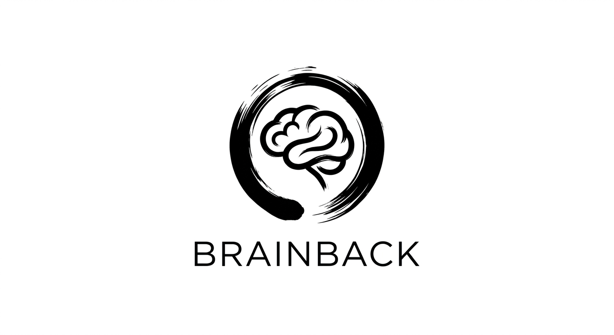

# Brainback: The Android Attention Firewall

**"Be back in your brain."**

Brainback is a minimalist, monochromatic Android application designed to break dopamine-driven scrolling loops. It acts as a surgical, system-level intervention to block short-form content (YouTube Shorts, Instagram Reels, and Browser-based Shorts) without the need for root access or complex DNS filtering.

  

---

## 🧠 The Philosophy
Short-form content is designed to hijack your attention. Brainback intercepts these behavioral signals at the Android accessibility layer and responds with an immediate system-level "Back" action. It’s not just a blocker; it’s a behavioral circuit breaker.

## ✨ Features
- **Surgical Blocking:** Targets only Shorts/Reels players, leaving the main apps (YouTube/Instagram) fully functional for intentional use.
- **Monochromatic Branding:** A "Digital Clarity" design system that eliminates visual noise and promotes mindfulness.
- **Holistic Visualizer:** A rotating "MAP" ring and detailed "LIST" log that track your interventions in real-time.
- **Digital Wellbeing Integration:** Deep-linked focus stats pulled directly from Android system data.
- **Anonymous Friction Lock:** A 30-minute "Hard Lock" that generates a random password, preventing impulsive firewall deactivation.
- **AI-Ready Export:** Generate a structured JSON report of your usage to get personalized coaching from AIs like Gemini or ChatGPT.
- **Battery Positive:** By reducing high-drain video playback, Brainback often saves more battery than it consumes.

## 🛠️ Installation
1. Download the latest `app-debug.apk` from the [Releases](https://github.com/yourusername/BrainBack/releases) section.
2. Enable **Accessibility Services** for Brainback in your phone settings.
3. Grant **Usage Access** permission to see your focus stats.
4. (Optional) Enable **Display over other apps** for advanced friction features.

## 🌐 Web Extension
Brainback also includes a Chromium/Firefox extension to de-clutter YouTube on your desktop by removing the Shorts shelf and recommendation sidebars. Find it in the `/Brainback-Extension` folder.

## 🛡️ Privacy
- **100% Local:** No backend servers. No data collection.
- **Zero Tracking:** Your attention data stays on your device.
- **Open Source:** Transparent code for a transparent mission.

---
*Created with intention by Naman.*
